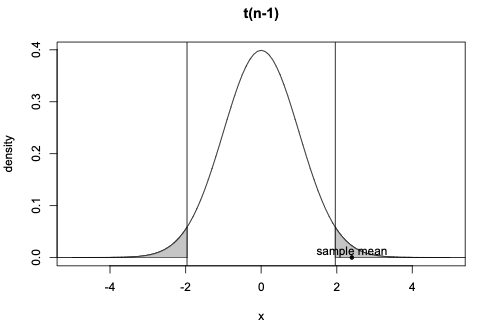
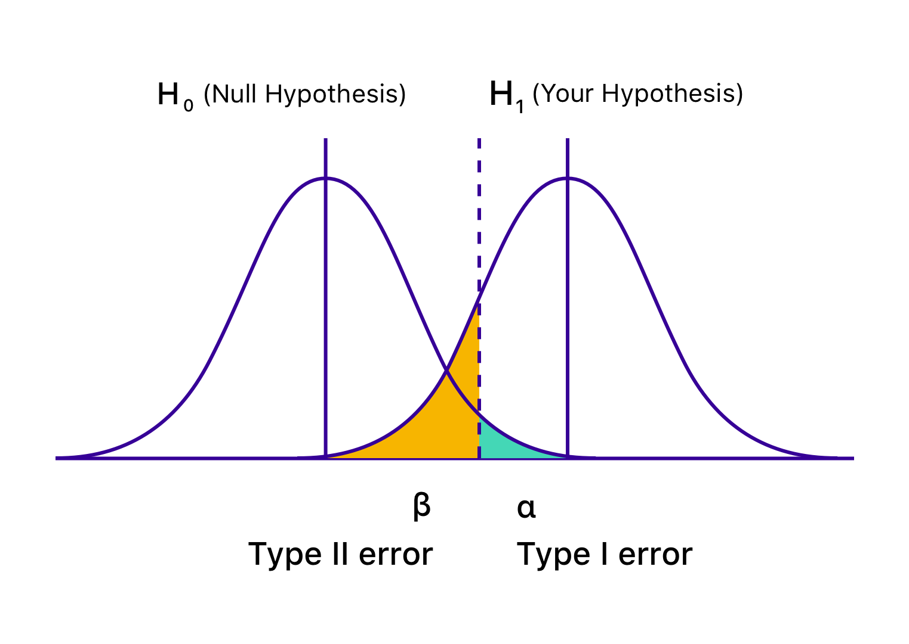
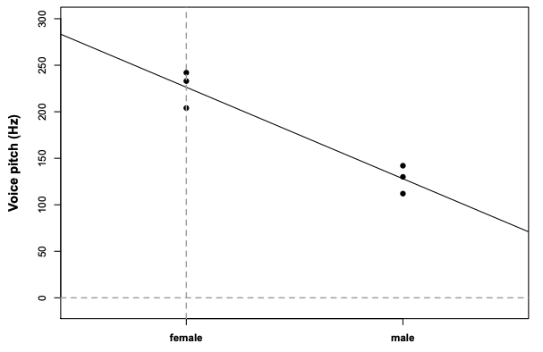
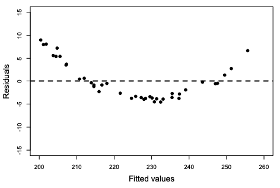
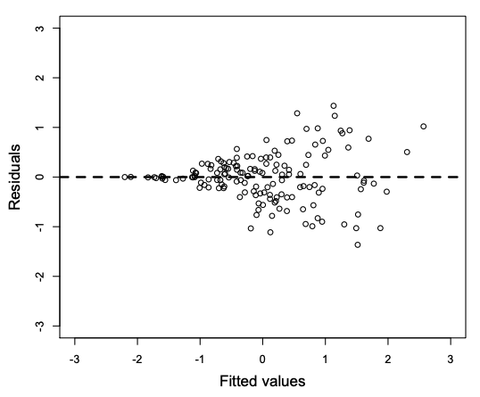

```{r packages, include=FALSE}
library(icons)
library(tidyverse)
```
class: right, middle

## Find me at...


[`r fontawesome("twitter")` @ChenziAmy](http://twitter.com/ChenziAmy)  
[`r fontawesome("github")` @chenchenzi](https://github.com/chenchenzi)  
[`r fontawesome("link", style = "solid")` chenzixu.rbind.io](https://alison.rbind.io)

---
## Did you do the **pre-workshop setup**?

`r icons::fontawesome("link", style = "solid")` [https://chenzixu.rbind.io/talk/lme/](https://chenzixu.rbind.io/talk/lme/)

## We assume:
`r icons::fontawesome$brands$'r-project'` You have basic knowledge about R and R studio.

`r icons::fontawesome$solid$'chart-bar'` You have basic inferential statistical knowledge.

###You want to know more about linear mixed models
```{r setup, include=FALSE}
options(htmltools.dir.version = FALSE)
```

???
high school arithmetic and algebra. Elementary concepts of probability theory are assumed; the sum and the product rules, and the fact that the probabilities of all possible events must sum to 1, are the extent of the knowledge assumed. 

---

# Outline

1. Inferential Stats Recap

1. Linear Regression

1. Linear Mixed Effects Model

1. More on Fixed VS Random effects

1. Report Writing

1. Limitations

---
class: inverse, center, middle

# Inferential Stats Recap
--

(~~magic~~) Central limit theorem

Hypothesis testing: the (humble) t-test
---
# Central limit theorem (~~magic~~)
.left-column[
###Definition and Significance]
.right-column[The **sampling distribution of means** is **normal**, provided two conditions are met: 
(a) the sample size should be **large** enough
(b) $\mu$ and $\sigma$ are defined for the probability density or mass function that generated the data. 


We can derive an estimate of the distribution of (hypothetical) sample means from a single sample of n independent data points

CLT is NOT the distribution that generated the data, but the sampling distribution of the sample means under **repeated sampling**.

]


---
# Hypothesis testing: the (humble) t-test
.left-column[
### NHST procedure

]
.right-column[1. Define the null hypothesis $\mu_0$
1. Given data of size $n$, estimate $\bar{y}$, standard deviation $s$, estimate the standard error $SE = s/{\sqrt{n}}$.
1. The distance between the sample mean and the hypothesized mean can be written in SE units as follows.$$ t \times SE = \bar{y} -\mu$$
Thus the sample mean is **t** standard errors away from the hypothesized mean: $$t= \dfrac{\bar{y}-\mu_0}{s/\sqrt{n}}$$
1. Reject null hypothesis if the observed t-value is “large”.
1. Fail to reject the null hypothesis, if the observed t-value is “small”.
]
???
One of the simplest statistical tests that one can do with continuous data: the t-test.
the logic of these more complex tests will essentially be more of the same
---
# Hypothesis testing: the (humble) t-test
.pull-left[Under repeated sampling, the observed t-value is seen as an instance from a random variable T.
$$ T \sim t(n-1)$$
The PDF of T, the t-distribution, is defined in terms of of n with n-1 degrees of freedom.


**Critical t-value**: the t-value such that $P(T>|t|)=0.05$
]
.pull-right[
**Type I error**: Reject the null when it’s true
**Type II error**: Fail to reject the null when it’s false


**p-value**: the probability of obtaining the observed t-value, or some value more extreme than that, under the assumption that the null is true. 

The p-value is always interpreted with reference to the pre-defined Type I error. Conventionally, we reject the null if $p < 0.05$
]
???
Two possible decisions: **reject the null** or **fail to reject the null**.
Two possible worlds: the null is **true** or **false**.
---
class: inverse, center, middle

# Linear Regression

--

Formal forms

A (too) simple case study

Understanding output

Assumptions check
---
# Formal forms

A simple example of linear model is
$$Y_i = \beta_0 + \beta_1X_i + e_i$$
Where $Y_i$ is the measured value of the dependent variable for observation i; $X_i$ is the explanatory variable or predictor; $Y_i$ is modelled in terms of an intercept $\beta_0$ plus the effect of predictor $X_i$ weighted by coefficient $\beta_1$ and error term $e_i$.
.left-col[
```{r, fig.width=4, fig.height=4, echo=FALSE}
set.seed(62)

dat <- tibble(X = runif(100, -3, 3),
              Y = 3 + 2 * X + rnorm(100))

ggplot(dat, aes(X, Y)) +
  geom_point() +
  geom_abline(intercept = 3, slope = 2, color = "#b682a0")

```
]
.right-col[
Simulated data illustrating linear model $Y_i = 3+2X_i+e_i$.
The most common method for fitting a regression line is **least-squares**.

A linear model is a model that is **linear in the coefficients**; each coefficient is only allowed to be set to the power of one.

Non-linear relationships can be analysed using a linear model.]

???
LME an extension of the General Linear Model that underlies simpler approaches such as ANOVA, t-test, and classical regression.
Many people assume that 'linear models' can only capture linear relationships, i.e., relationships that can be described by a straight line (or a plane). This is false.
A linear model is a weighted sum of various terms, and each term has a single predictor (or a constant) that is multiplied by a coefficient. 
---
# A simple case study
.pull-left[ #### Research question
Assume you were interested in whether the voice pitch of males and females differs, and if so, by how much.
#### Data
```{r comment='#'}
pitch = c(233,204,242,130,112,142)
sex = c(rep("female",3), rep("male",3))
my.df = data.frame(sex,pitch)
my.df
```
]

.pull-right[ #### Formula
Relationship of interest: $pitch \sim sex$ 

"Pitch predicted by / as a function of sex"

$pitch \sim sex + \epsilon$

$\epsilon$ stands for all other things that affect pitch, random or controllable in our experiment.

**Structural or systematic** + **random or probabilistic**
```{r}
model = lm(pitch ~ sex, my.df)
```
#### Dummy coding for categorical factors
]
.footnote[This example is taken from Bodo Winter's tutorial.]
---
# Understanding output
.pull-left[
```{r, comment='#', highlight.output=c(17, 18)}
summary(model)
```
]
.pull-right[ $R^2$: "variance accounted for or explained by"

Multiple R-Squared: how much variance in our data is accounted for by our model

Adjusted R-Squared: how much variance is “explained” and how many fixed effects are used

**p-value**: The probability of our data, given that our null hypothesis "sex has no effect on pitch" is true.

#### Reporting: 
We constructed a linear model of pitch as a function of sex. This model was significant $(F(1,4)=46.61,	p<0.01)$.
]

---
# Understanding output
.pull-left[
```{r, comment='#'}
summary(model)
```
]
.pull-right[
```{r, comment='#'}
mean(my.df[my.df$sex=="female",]$pitch)
mean(my.df[my.df$sex=="male",]$pitch)
```

]
---
# Assumptions check

### (1) Linearity
The fitted values (line) are the predicted means, and residuals are the **vertical deviations** from this line.

When the residual plot shows a **curvy** or non-linear patterns, it indicates a violation of the linearity assumption.

.pull-left[ 
```{r eval=FALSE}
plot(fitted(model),residuals(model))
```

]
.pull-right[ What to do if your residual plot indicates nonlinearity?
- Reconsider the fixed effects
- Perform non-linear transformation of your variables
- Turn to different class of models such as logistic models
]

???
conditions that have to be satisfied in order for the linear model to be meaningful.

---
# Assumptions check
.pull-left[### (2) Absence of collinearity
When two predictors are **correlated** with each other, they are **collinear**.

- Preempt the problem in the design stage

- Use dimension reduction techniques such as Principal Component Analysis that transform correlated variables into a smaller set of variables
]
.pull-right[### (3) Homoskedasticity
The variance of your data should be approximately equal across the range of the predicted values.
- Transform your data

]

---
# Assumptions check
.pull-left[### (4) Absence of influential data points

```{r comment='#'}
dfbeta(model)
```

]
.pull-right[
**DFbeta** values: the coefficients to be adjusted if a particular data point is excluded (“leave-one-out diagnostics”).
- Eyeball the DFbeta values: any sign changed? different by half of the absolute value?

- Run the analysis **with** influential data and then again **without** them. Compare and discuss the results.

`dfbeta()` for linear models doesn’t work for mixed models. You can check out the package **influence.ME** (Nieuwenhuis, te Grotenhuis, & Pelzer, 2012), or program a for loop that does the leave-one-out diagnostics by hand.
]

---
# Assumptions check
### (5) Normality of residuals
- a histogram or a Q-Q plot of the residuals
```{r eval=FALSE}
hist(residuals(model))
qqnorm(residuals(model))
```

### (6) Independence
- Preempt the problem in the design stage
- Resolve non-independencies at the analysis stage. $\rightarrow$ **Mixed models**
---
class: inverse, center, middle

# Linear Mixed Effects Model

--
Data

Model

Assumption

Understanding the output

Model selection
---
# Data

#### Research Question
We're interested in the relationship between pitch and politeness (Winter & Grawunder, 2012).

- Politeness: formal/polite and informal register (categorical factor)
- multiple measures per subject (**inter-dependent!**)
```{r comment='#'}
data = read.csv("http://www.bodowinter.com/tutorial/politeness_data.csv")
head(data)
which(!complete.cases(data))
```
???
a few missing values provide no problems for our mixed model analyses
---
# Model
Linear regression
$$pitch \sim politeness + \epsilon$$
Multiple regression (fixed effects only)
$$pitch \sim politeness + sex + \epsilon$$
Add a **random** effect for subject: assume a different "baseline" pitch value for each subject. We can assume different random intercepts for each subject.
$$pitch \sim politeness + sex + (1|subject) + \epsilon$$
```{r eval=FALSE}
boxplot(frequency~subject, data)
```
By-item variation: different scenarios for formal and informal speech
$$pitch \sim politeness + sex + (1|subject) + (1|item) + \epsilon$$
---
# Model in R
```{r comment='#'}
library(lme4)
data = data %>% mutate(attitude=as.factor(attitude), gender=as.factor(gender), subject=as.factor(subject))

politeness.model0 = lmer(frequency ~ attitude + (1|subject) + (1|scenario), data=data)
politeness.model = lmer(frequency ~ attitude + gender + (1|subject) + (1|scenario), data=data)
summary(politeness.model)
```

---
# Understanding the output
.left-column[#### politeness.model0 (top) politeness.model (bottom)

Scenario (item) has much less variability than subject.

Residual: The “random” deviations from the predicted values that are not due to subjects and items, $\epsilon$.

The variation that’s associated with the random effect “subject” dropped considerably $\rightarrow$ gender was confounded with the variation that is due to subject.
]
.right-column[#### Random effects
```{r eval=FALSE}
Random effects:
  Groups   Name        Variance Std.Dev.
  scenario (Intercept)  219     14.80   
* subject  (Intercept) 4015     63.36   
* Residual              646     25.42   
Number of obs: 83, groups:  scenario, 7; subject, 6

```

```{r eval=FALSE}
Random effects:
  Groups   Name        Variance Std.Dev.
  scenario (Intercept) 219.5    14.81   
* subject  (Intercept) 615.6    24.81   
* Residual             645.9    25.41   
Number of obs: 83, groups:  scenario, 7; subject, 6
```
]
???
shifted a considerable amount of the variance that was previously in the random effects component(differences between male and female individuals) to the fixed effects component
---
# Understanding the output
.left-column[#### politeness.model0 (top) politeness.model (bottom)
`attitudepol` is the slope for the categorical effect of politeness.

Pitch is lower in polite speech than in informal speech, by about 20 Hz.

`lmer()` took whatever comes first in the alphabet to be the reference level.

The second `Intercept` represents the female for the informal condition.
]
.right-column[#### Fixed effects
```{r eval=FALSE}
Fixed effects:
              Estimate Std. Error t value
* (Intercept)  202.588     26.754   7.572
  attitudepol  -19.695      5.585  -3.527
```

```{r eval=FALSE}
Fixed effects:
              Estimate Std. Error t value
* (Intercept)  256.846     16.116  15.938
  attitudepol  -19.721      5.584  -3.532
  genderM     -108.516     21.013  -5.164
```
]
---
# Understanding the output
#### Coding schemes
A categorical variable of $n$ levels is entered into a regression analysis as a sequence of $n-1$ variables. Generally or by default in R, we use dummy coding for them.

```{r comment='#'}
contrasts(data$attitude)

# change the reference level
contrasts(data$attitude) = contr.treatment(2, base = 2)
contrasts(data$attitude)
```

There are also other coding schemes such as **effects coding** including **contrast coding**, **sum coding** and **Helmert coding**. Different coding system may help answer different research questions. It also greatly changes the way you interpret your output.

---
# Understanding the output
#### Statistical significance
Unfortunately, p-values for mixed models aren’t as straightforward as they are for the linear model. There are multiple approaches, and there’s a discussion surrounding these, with sometimes wildly differing opinions about which approach is the best.

There is a package `lmerTest` that provides $p$ values in type I, II or III anova and summery tables for `lmer` model fits via Satterthwaite's degrees of freedom method or Kenward-Roger method.

```{r comment='#'}
library(lmerTest)
politeness.model = lmer(frequency ~ attitude + gender + (1|subject) + (1|scenario), data=data)
anova(politeness.model)
```

---
# Understanding the output
#### Statistical significance
Likelihood Ratio Test as a means to attain $p$ values. Likelihood is the probability of seeing the data you collected given your model. 
```{r comment='#'}
politeness.null = lmer(frequency ~ gender + (1|subject) + (1|scenario), data=data, REML=FALSE)
politeness.full = lmer(frequency ~ attitude + gender + (1|subject) + (1|scenario), data=data, REML=FALSE)

anova(politeness.null, politeness.full)
```

“… politeness affected pitch ($ \chi^2(1)=11.62, p=0.00065)$ , lowering it by about 19.7 Hz ± 5.6 (standard errors) …”
---
# Model selection
.pull-left[
```{r comment='#'}
coef(politeness.model)
```
]
.pull-right[ #### Random intercept model
We accounted for baseline-differences in pitch, but the effect of politeness is the same for all subjects and items.

What if the **effect of politeness** might be different for different subjects?
]

---
# Model selection
#### Random slope model
```{r eval=FALSE}
politeness.model1 = lmer(frequency~attitude + gender + (1+attitude|subject) + (1+attitude|scenario), data = data)
coef(politeness.model1)
```
.pull-left[Random intercept model
```{r eval=FALSE}
$subject
   (Intercept) attitude2   genderM
F1    242.9386 -19.72111 -108.5163
F2    267.2654 -19.72111 -108.5163
F3    260.3348 -19.72111 -108.5163
M3    285.2283 -19.72111 -108.5163
M4    262.2248 -19.72111 -108.5163
M7    223.0858 -19.72111 -108.5163
```
]
.pull-right[Random slope model
```{r eval=FALSE}
$subject
   (Intercept) attitude2   genderM
F1    243.2804 -20.49940 -111.1058
F2    267.1173 -19.30447 -111.1058
F3    260.2849 -19.64697 -111.1058
M3    287.1024 -18.30263 -111.1058
M4    264.6698 -19.42716 -111.1058
M7    226.3911 -21.34605 -111.1058
```
]

Despite individual variation, there is also consistency in how politeness affects the voice: for all of our speakers, the voice tends to go
down when speaking politely, but for some people it goes down slightly more so than for others.
???
The effect of politeness (`attitudepol`) is different for each subject and item. It’s always negative and many of the values are quite similar to each
other.
---
# Model selection

#### Interaction terms
An interaction occurs when one variable changes how another variable affects the response variable.

#### Overfitting
overfitting occurs when your model has too small a sample size and too many predictor variables. You may get a warning that your model wouldn’t converge.

#### How to choose your model?
- **Depend on your research question and data structure**
- Some prefer to proceed incrementally, taking time to examine data. 
- One should always be cautious of creating a model that is too complex.
- Some researchers have shown via simulations that mixed models without random slopes have a relatively high Type I error rate (Schielzeth & Forstmeier, 2009; Barr, Levy, Scheepers, & Tilly, 2013)
- Barr et al.(2013) recommend that you should “keep it maximal” with respect to your random effects structure, at least for controlled experiments.

???
We were not interested in gender differences, but they are well worth
controlling for. This is why we had random slopes for the effect of attitude (by subjects and item) but not gender. 

---
class: inverse, middle, center

# More on Fixed VS Random effects
--
Data

Complete pooling

No pooling

Partial pooling

---
# Data
#### Research question
The effects of sleep deprivation on psychomotor performance (Belenky et al., 2003)

Documentation for the dataset `?sleepstudy` $\rightarrow$ Multilevel data with continuous predictor

#### Plot the data
```{r}
sleep2 <- sleepstudy %>%
  filter(Days >= 2) %>%
  mutate(days_deprived = Days - 2)

ggplot(sleep2, aes(x = days_deprived, y = Reaction)) +
  geom_point() +
  scale_x_continuous(breaks = 0:7) +
  facet_wrap(~Subject) +
  labs(y = "Reaction Time", 
       x = "Days deprived of sleep (0 = baseline)")
```

---

# Complete pooling


---

# No pooling

You can write LaTeX math expressions inside a pair of dollar signs, e.g. &#36;\alpha+\beta$ renders $\alpha+\beta$. You can use the display style with double dollar signs:


---

# Partial pooling


---

# R Plots

```{r cars, fig.height=4, dev='svg'}
par(mar = c(4, 4, 1, .1))
plot(cars, pch = 19, col = 'darkgray', las = 1)
abline(fit, lwd = 2)
```

---

# Tables

If you want to generate a table, make sure it is in the HTML format (instead of Markdown or other formats), e.g.,

```{r}
knitr::kable(head(iris), format = 'html')
```

---


---


---

```{r eval=require('DT'), tidy=FALSE}
DT::datatable(
  head(iris, 10),
  fillContainer = FALSE, options = list(pageLength = 8)
)
```

---


---

# Some Tips


---

# Some Tips


    
---

    
--

- If you'd like to create your own title slide, disable **xaringan**'s title slide with the `seal = FALSE` option of `moon_reader`.

    ```yaml
    output:
      xaringan::moon_reader:
        seal: false
    ```

---

# Some Tips

- There are several ways to build incremental slides. See [this presentation](https://slides.yihui.org/xaringan/incremental.html) for examples.

- The option `highlightLines: true` of `nature` will highlight code lines that start with `*`, or are wrapped in `{{ }}`, or have trailing comments `#<<`;

    ```yaml
    output:
      xaringan::moon_reader:
        nature:
          highlightLines: true
    ```

    See examples on the next page.

---


---

# Some Tips

An example of using the trailing comment `#<<` to highlight lines:

````markdown
`r ''````{r tidy=FALSE}
library(ggplot2)
ggplot(mtcars) + 
  aes(mpg, disp) + 
  geom_point() +   #<<
  geom_smooth()    #<<
```
````

Output:

```{r tidy=FALSE, eval=FALSE}
library(ggplot2)
ggplot(mtcars) + 
  aes(mpg, disp) + 
  geom_point() +   #<<
  geom_smooth()    #<<
```

---

# Some Tips

When you enable line-highlighting, you can also use the chunk option `highlight.output` to highlight specific lines of the text output from a code chunk. For example, `highlight.output = TRUE` means highlighting all lines, and `highlight.output = c(1, 3)` means highlighting the first and third line.

````md
`r ''````{r, highlight.output=c(1, 3)}
head(iris)
```
````

```{r, highlight.output=c(1, 3), echo=FALSE}
head(iris)
```

Question: what does `highlight.output = c(TRUE, FALSE)` mean? (Hint: think about R's recycling of vectors)

---

# Some Tips

- To make slides work offline, you need to download a copy of remark.js in advance, because **xaringan** uses the online version by default (see the help page `?xaringan::moon_reader`).

- You can use `xaringan::summon_remark()` to download the latest or a specified version of remark.js. By default, it is downloaded to `libs/remark-latest.min.js`.

- Then change the `chakra` option in YAML to point to this file, e.g.

    ```yaml
    output:
      xaringan::moon_reader:
        chakra: libs/remark-latest.min.js
    ```

- If you used Google fonts in slides (the default theme uses _Yanone Kaffeesatz_, _Droid Serif_, and _Source Code Pro_), they won't work offline unless you download or install them locally. The Heroku app [google-webfonts-helper](https://google-webfonts-helper.herokuapp.com/fonts) can help you download fonts and generate the necessary CSS.

---

# Macros


---

# Macros (continued)


---

# CSS

Among all options in `xaringan::moon_reader`, the most challenging but perhaps also the most rewarding one is `css`, because it allows you to customize the appearance of your slides using any CSS rules or hacks you know.

You can see the default CSS file [here](https://github.com/yihui/xaringan/blob/master/inst/rmarkdown/templates/xaringan/resources/default.css). You can completely replace it with your own CSS files, or define new rules to override the default. See the help page `?xaringan::moon_reader` for more information.

---

# CSS

For example, suppose you want to change the font for code from the default "Source Code Pro" to "Ubuntu Mono". You can create a CSS file named, say, `ubuntu-mono.css`:

```css
@import url(https://fonts.googleapis.com/css?family=Ubuntu+Mono:400,700,400italic);

.remark-code, .remark-inline-code { font-family: 'Ubuntu Mono'; }
```

Then set the `css` option in the YAML metadata:

```yaml
output:
  xaringan::moon_reader:
    css: ["default", "ubuntu-mono.css"]
```

Here I assume `ubuntu-mono.css` is under the same directory as your Rmd.

See [yihui/xaringan#83](https://github.com/yihui/xaringan/issues/83) for an example of using the [Fira Code](https://github.com/tonsky/FiraCode) font, which supports ligatures in program code.

---

# CSS (with Sass)

**xaringan** also supports Sass support via **rmarkdown**. Suppose you want to use the same color for different elements, e.g., first heading and bold text. You can create a `.scss` file, say `mytheme.scss`, using the [sass](https://sass-lang.com/) syntax with variables:

```scss
$mycolor: #ff0000; 
.remark-slide-content > h1 { color: $mycolor; }
.remark-slide-content strong { color: $mycolor; }
```

Then set the `css` option in the YAML metadata using this file placed under the same directory as your Rmd:

```yaml
output:
  xaringan::moon_reader:
    css: ["default", "mytheme.scss"]
```

This requires **rmarkdown** >= 2.8 and the [**sass**](https://rstudio.github.io/sass/) package. You can learn more about **rmarkdown** and **sass** support in [this blog post](https://blog.rstudio.com/2021/04/15/2021-spring-rmd-news/#sass-and-scss-support-for-html-based-output) and in [**sass** overview vignette](https://rstudio.github.io/sass/articles/sass.html).

---

# Themes

Don't want to learn CSS? Okay, you can use some user-contributed themes. A theme typically consists of two CSS files `foo.css` and `foo-fonts.css`, where `foo` is the theme name. Below are some existing themes:

```{r, R.options=list(width = 70)}
names(xaringan:::list_css())
```

---

# Themes

To use a theme, you can specify the `css` option as an array of CSS filenames (without the `.css` extensions), e.g.,

```yaml
output:
  xaringan::moon_reader:
    css: [default, metropolis, metropolis-fonts]
```

If you want to contribute a theme to **xaringan**, please read [this blog post](https://yihui.org/en/2017/10/xaringan-themes).

---
class: inverse, middle, center
background-image: url(https://upload.wikimedia.org/wikipedia/commons/3/39/Naruto_Shiki_Fujin.svg)
background-size: contain

# Naruto

---
background-image: url(https://upload.wikimedia.org/wikipedia/commons/b/be/Sharingan_triple.svg)
background-size: 100px
background-position: 90% 8%

# Sharingan

The R package name **xaringan** was derived<sup>1</sup> from **Sharingan**, a dōjutsu in the Japanese anime _Naruto_ with two abilities:

- the "Eye of Insight"

- the "Eye of Hypnotism"

I think a presentation is basically a way to communicate insights to the audience, and a great presentation may even "hypnotize" the audience.<sup>2,3</sup>

.footnote[
[1] In Chinese, the pronounciation of _X_ is _Sh_ /ʃ/ (as in _shrimp_). Now you should have a better idea of how to pronounce my last name _Xie_.

[2] By comparison, bad presentations only put the audience to sleep.

[3] Personally I find that setting background images for slides is a killer feature of remark.js. It is an effective way to bring visual impact into your presentations.
]

---

# Naruto terminology

The **xaringan** package borrowed a few terms from Naruto, such as

- [Sharingan](https://naruto.fandom.com/wiki/Sharingan) (写輪眼; the package name)

- The [moon reader](https://naruto.fandom.com/wiki/Moon_Reader) (月読; an attractive R Markdown output format)

- [Chakra](https://naruto.fandom.com/wiki/Chakra) (查克拉; the path to the remark.js library, which is the power to drive the presentation)

- [Nature transformation](https://naruto.fandom.com/wiki/Nature_Transformation) (性質変化; transform the chakra by setting different options)

- The [infinite moon reader](https://naruto.fandom.com/wiki/Infinite_Tsukuyomi) (無限月読; start a local web server to continuously serve your slides)

- The [summoning technique](https://naruto.fandom.com/wiki/Summoning_Technique) (download remark.js from the web)

You can click the links to know more about them if you want. The jutsu "Moon Reader" may seem a little evil, but that does not mean your slides are evil.

---
# References

Winter, B. (2013). Linear models and linear mixed effects models in R with linguistic applications. arXiv:1308.5499. [http://arxiv.org/pdf/1308.5499.pdf]

Shravan Vasishth, Daniel Schad, Audrey Bürki, Reinhold Kliegl. (on going) Linear Mixed Models in Linguistics and Psychology: A Comprehensive Introduction. [https://vasishth.github.io/Freq_CogSci/]

Barr, Dale J. (2021). Learning statistical models through simulation in R: An interactive textbook. Version 1.0.0. Retrieved from https://psyteachr.github.io/stat-models-v1.


---

class: center, middle

# Thanks!

Slides created via the R package [**xaringan**](https://github.com/yihui/xaringan).

The chakra comes from [remark.js](https://remarkjs.com), [**knitr**](https://yihui.org/knitr/), and [R Markdown](https://rmarkdown.rstudio.com).
