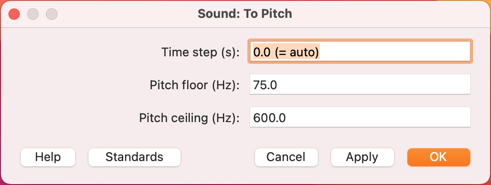
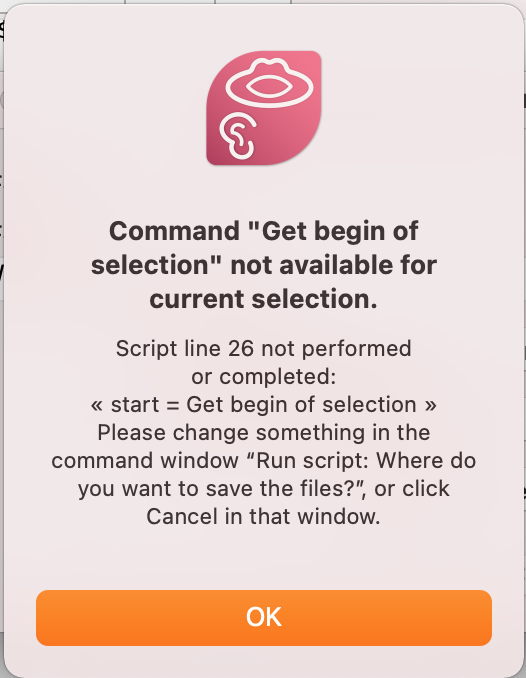
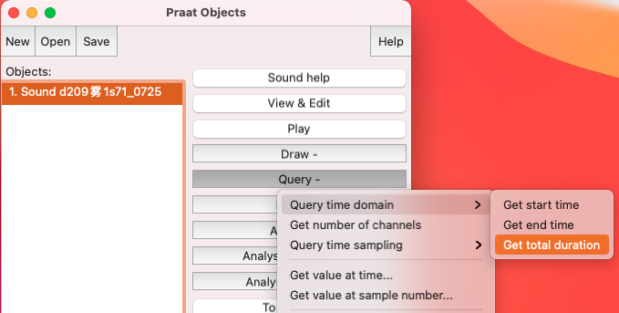
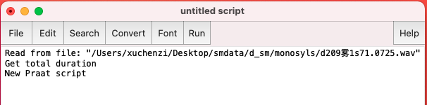
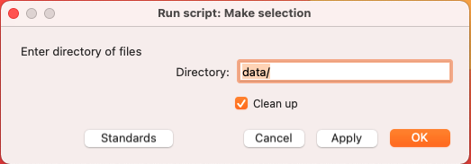
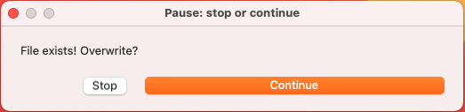

```{r setup, include=FALSE}
options(htmltools.dir.version = FALSE)
knitr::opts_chunk$set(
  fig.width=9, fig.height=3.5, fig.retina=3,
  out.width = "100%",
  cache = FALSE,
  echo = TRUE,
  message = FALSE, 
  warning = FALSE,
  hiline = TRUE
  #eval = TRUE
)
```

```{r xaringan-themer, include=FALSE, warning=FALSE}
library(icons)
library(xaringanthemer)
  dark_yellow <- "#EFBE43"
  light_yellow <- "#FDF7E9"
  gray <- "#333333"
  blue <- "#4466B0"

  style_duo(
  # colors
  primary_color = light_yellow,
  secondary_color = dark_yellow,
  #inverse_header_color = "#FFFFFF"
  header_color = gray,
  text_color = gray,
  code_inline_color = colorspace::lighten(gray),
  text_bold_color = colorspace::lighten(gray),
  link_color = blue,
  #title_slide_text_color = blue,

  # fonts
  header_font_google = google_font("Martel", "300", "400"),
  text_font_google = google_font("Lato"),
  code_font_google = google_font("Fira Mono")
  
)
```
name: title
class: left, middle

.fancy[Introduction to Praat and Praat Scripting]

.big[Lab Skills Workshop, Phonetics Laboratory, University of Oxford]

<br />

###Chenzi Xu

.big[DPhil Candidate | 2021/12/30 (updated: `r Sys.Date()`)]

---
class: right, middle


## Find me at...

[`r fontawesome("twitter")` @ChenziAmy](http://twitter.com/ChenziAmy)  
[`r fontawesome("github")` @chenchenzi](https://github.com/chenchenzi)  
[`r fontawesome("link", style = "solid")` chenzixu.rbind.io](https://chenzixu.rbind.io)  

---
# Our Goal

.left-column[
### First

### Second

### Third
]

.right-co[
.big[To know a full range of functions Praat can perform

To master how to navigate and use Praat's GUI

To learn scripting basics, parse praat script, and .fancysmall[start] praat scripting]

]

???
Q: 1. how many have used Praat? 2. how many have used praat scripts?
3. how many have learnt other scripting/programming languages?

---
## Outline
.right-column[
1. ### [Why Praat?](#why)

1. ### [What is Praat capable of?](#functions)

1. ### [Praat scripting](#script)

1. ### [Demo and Practice](#demo)

]

---
class: inverse center middle

# Why Praat? 

---

name: why

## Why Praat?

- Open source, **free** of charge

- Available for major computer platforms (MacOS, Windows, Linux) and systems

- Graphical User Interface

- A macro recording mechanism (Command History)

- You can create your own Praat scripts to .fancysmall[automate] things! 
  - Recurring tasks become less tedious and more efficient.
  - **Consistent** and **Replicable** measurement
  - Minimising human error

- You can create your own application with an autonomous GUI.
  - Python-praat package: [Parselmouth](https://parselmouth.readthedocs.io/en/stable/)
  - R-praat package: [rPraat](https://fu.ff.cuni.cz/praat/rDemo.html)

???
commercial software
countless hours of soul-crushing repetitions
---
name: functions
class: inverse center middle

# What is Praat capable of?

--
.medium[
**Creating and manipulating sounds**

**Visualizing and annotating sounds**

**Phonetic measurement and analysis**

**Creating publication-quality plots**

**Conducting phonetic experiment**
]
---
name: chart
background-image: url('praat.png')
background-size: cover
background-position: middle right


---

## Are you familiar with these tasks?
.medium[
- Loading files

- Managing objects (create, copy, rename, save, remove)

- View objects and analyses

- Setting analysis parameters

- Querying objects (using buttons or menu commands)

- TextGrid annotation
]

???
Demonstrate load file,view, textgrid, draw a pic.
---
background-image: url('spectrogram.png')
background-position: 90% 70%

## Are you familiar with these tasks?
.left-co[
**` Spectrum > Show spectrogram`**

**` Pulses > Show pulses`**

**` Pitch > Show pitch`**

**` Intensity > Show intensity`**

**`Formant > Show formants`**
]


---

## What does Praat contain?
.pull-l[
###Praat Objects
- Sound
- TextGrid
- Spectrogram
- Pitch, PitchTier
- Intensity, IntensityTier
- ExperimentMFC
- ...
]

.pull-m[
###Praat Editors
- SoundEditor
- TextGridEditor
- PitchEditor
- PointEditor
- SpectrumEditor
- ...
]

.pull-r[
###Praat Commands
- To Intensity...
- To TextGrid...
- Zoom in
- Get Minimum
- Convert to mono
- ...
]

.footnote[You must select the **correct** object/environment to **issue** the right commands!]
---
name: script
class: inverse center middle

# Praat Script

--
**String and numeric variables**

**For loops, if else statements, while loops**

**Regular expression matching**

**Comments**

**Syntax**

--

### OR ... Fast track?

???
teach fishing

Sequentially ordered set of instructions that are given to a program that can interpret & execute them

editor type in instructions/commands

In programming, a variable is a place in the computer’s memory where something is stored, containers.name = value

---
background-image: url('pitch1.png')
background-size: 32% 56%
background-position: 10% 90%
## Scripting Hacks I
### Check GUI for Syntax

.pull-right[


```{r, eval=FALSE}
* To Pitch: 0.0, 75.0, 600.0
```

]
???
We're all linguist. Transitive Verbs take direct object otherwise ungrammatical.

command: arguments/components too! otherwise not running

---
## Scripting Hacks II
### Macro Recording Workflow (Command History)
- Obtain a sequence of instructions

```
1. New Praat Script
2. Edit > Clear history (script editor)
3. GUI actions
4. Edit > Paste history (script editor)
```

---
background-image: url('save.png')
background-size: 40% 70%
background-position: 90% 80%

## Scripting Hacks III
### Parse others' script and adapt

.pull-left[

- Parse the script in chunks and see if they suit your needs. Sometimes no need to reinvent the wheels.

- Learn from others' script.

> Be cautious when using others'script. The syntax of Praat was updated since 2014.

> **Test** it out first and remember to **cite** it!
>
> **Save frequently!**

]

---
## Scripting Hacks IV
.left-co[
### Boilerplate code

Place all paths, input/output files, and global variables at the top

Paths must end with a backslash /

Paths can be **relative** or **absolute**

Windows: `"C:\Users\Chenzi\mydir\data\"`

Avoid "special" characters in file/path names.
]
.right-co[
```{r, eval=FALSE}
dir$ = "/Users/Chenzi/mydir/data/" #<<

Create Strings as file list: "file_list", dir$ + "*.wav"
nFiles = Get number of strings

for i from 1 to nFiles
    selectObject: "Strings file_list"
    filename$ = Get string: i
    basename$ = filename$ - ".wav"
    Read from file: dir$ + filename$
    
    ########################
    #### MORE CODE HERE ####
    ########################
    
endfor
```
]

???
formulaic, wrapper code
Underscore/lowercase is a good combo.
---
## Scripting Hacks IV
.left-co[
### Boilerplate code
Create list of all .wav files in the directory and save the number to a variable

String variable ends in **`$`**; strings wrapped in **`""`**

Assignment operator **`=`**

Variable names in Praat must begin with a lowercase ASCII letter
]
.right-co[
```{r, eval=FALSE}
dir$ = "/Users/Chenzi/mydir/data/" 

Create Strings as file list: "file_list", dir$ + "*.wav" #<<
nFiles = Get number of strings #<<

for i from 1 to nFiles
    selectObject: "Strings file_list"
    filename$ = Get string: i
    basename$ = filename$ - ".wav"
    Read from file: dir$ + filename$
    
    ########################
    #### MORE CODE HERE ####
    ########################
    
endfor
```
]

???
In Praat, Names must start with lowercase letters, and
have only letters, digits, and underscores.
Informative names help your future self to understand your script!
---
## Scripting Hacks IV
.left-co[
### Boilerplate code
Set up a for loop to iterate over all files on the list

`1` is the starting point. It `+1` each time through the loop

Comments (Praat will ignore) must start with "`#`" or "`;`"

Comments are good for reproducibility (and your future self)! 
]
.right-co[
```{r, eval=FALSE}
dir$ = "/Users/Chenzi/mydir/data/" 

Create Strings as file list: "file_list", dir$ + "*.wav"
nFiles = Get number of strings

# for-loop to iterate over all files on the list #<<
for i from 1 to nFiles #<<
    selectObject: "Strings file_list"
    filename$ = Get string: i
    basename$ = filename$ - ".wav"
    Read from file: dir$ + filename$
    
    ########################
    #### MORE CODE HERE ####
    ########################
    
endfor #<<
```
]


---
## Scripting Hacks IV
.left-co[
### Boilerplate code
Read in each .wav file.

`Get string` : get the nth row of the list of filenames

There are different ways to get the basename.

```
Read from file: dir$ + filename$
basename$ = selected$ ("Sound")
```

]
.right-co[
```{r, eval=FALSE}
dir$ = "/Users/Chenzi/mydir/data/" 

Create Strings as file list: "file_list", dir$ + "*.wav"
nFiles = Get number of strings

for i from 1 to nFiles
    selectObject: "Strings file_list" #<<
    filename$ = Get string: i #<<
    basename$ = filename$ - ".wav" #<<
    Read from file: dir$ + filename$ #<<
    
    ########################
    #### MORE CODE HERE ####
    ########################
    
endfor
```
]

---
## Scripting Hacks V
.left-col[

]
.right-co[### Errors are stepping stones
#### How to debug?
- In script editor: `Search > Go to line`
- Use `printline` statements regularly when testing

#### Types of errors
- Syntactic errors: typos, use of quotes, etc.
- Runtime errors: file doesn't exist, command doesn't exist etc.
- Semantic errors: output doesn't match your goal...

]

---
name: demo
class: inverse center middle

# Demo and Practice
Task 1: Get total duration of all .wav files

Task 2*: Measure f0 in specified interval

---
# Task 1
.pull-left[ ###Basics
1.1 Get the number of .wav files in a directory

1.2 Get duration of each .wav file

1.3 Get total duration of all .wav files

1.4 Print results in Praat Info window
]
.pull-right[ ###Level up
1.5 Toggle option to "clean up" as you go

1.6 Add a user input form

1.7 Write results to a Text file]

.footnote[Adapted from Thea Knowles's Praat Tutorial]
---
### Step 1: How to get duration of one .wav file?
.medium[1. Open one .wav file in Praat **`Open > Read from file`**
1. Select the Sound object, click **`Query > Query time domain > Get total duration`**
]


> Avoid using `.` in the filename (except in the file extension)

---
### Step 2: Print command history

.medium[
1. At menu bar, **`Praat > New Praat script`**
1. In the script editor, click **`Edit > Paste history`**
1. **`File > Save`**, type `"test.praat"`, and **`Run`**
]


> #### Limitations: 
>
> Query commands may behave differently in scripts than in the GUI (e.g. Praat scripting assumes that you want to handle the query result inside the script)
>
> Changing scripting environments is not recorded

???
my first praat script
---
### Step 3: Loop over all .wav files
.left-co[ ### Update the boilerplate code

### Any problems?
]
.right-co[
```{r, eval=FALSE}
dir$ = "data/" 

Create Strings as file list: "file_list", dir$ + "*.wav"
nFiles = Get number of strings

for i from 1 to nFiles
    selectObject: "Strings file_list"
    filename$ = Get string: i
    basename$ = filename$ - ".wav"
    Read from file: dir$ + filename$
    
    selectObject: "Sound 'basename$'" #<<
    Get total duration #<<
    
endfor
```
]

---
### Step 4: Manage output
.left-co[ ### Print out result
**`printline`** prints the argument to the Praat Info window

Contents of a variable enclosed in **`''`** in built-in Praat functions
(force Praat to substitute a string value for its variable name)

Numeric variable doesn't end in **`$`**


]
.right-co[
```{r, eval=FALSE}
dir$ = "data/" 

Create Strings as file list: "file_list", dir$ + "*.wav"
nFiles = Get number of strings
printline 'nFiles' #<<

for i from 1 to nFiles
    selectObject: "Strings file_list"
    filename$ = Get string: i
    basename$ = filename$ - ".wav"
    Read from file: dir$ + filename$
    printline 'basename$' #<<
    selectObject: "Sound 'basename$'"
    dur = Get total duration #<<
    printline 'dur' #<<
    
endfor

```
]

---
### Step 5: Calculation in a for loop
.left-co[ ### Sum
Set up a dummy numeric variable **`total_dur`** and update its value through each loop

Numeric variables must start with a lower case letter, and be only letters, digits, and underscores

**`:4`**: print with 4 decimal places

]
.right-co[
```{r, eval=FALSE}
dir$ = "data/" 
Create Strings as file list: "file_list", dir$ + "*.wav"
nFiles = Get number of strings
total_dur = 0 #<<

for i from 1 to nFiles
    selectObject: "Strings file_list"
    filename$ = Get string: i
    basename$ = filename$ - ".wav"
    Read from file: dir$ + filename$
    printline 'basename$'
    selectObject: "Sound 'basename$'"
    dur = Get total duration
    printline 'dur' 
    total_dur = total_dur + dur #<<
    
endfor
printline 'total_dur:4' #<<
```
]

---
### Level up (optional)
.left-col[ ### Clean up
There are different methods.

Sometimes leaving objects helps debugging.
]
.right-col[
```{r, eval=FALSE}
clearinfo #<<

for i from 1 to nFiles

    #### MORE CODE HERE ####
    
    select all #<<
    minus Strings file_list #<<
    Remove #<<
endfor

select all #<<
Remove #<<
printline All finished! #<<
```
]

---
### Level up (optional)
.footnote[More info at [Praat manual](https://www.fon.hum.uva.nl/praat/manual/Scripting_6_1__Arguments_to_the_script.html) and [Phonetics on Speed](https://praatscripting.lingphon.net/simpleinput-1.html)]
.left-col[ ### User Input form
Input forms are composed of fields, one per line.
User provides arguments to the script.

Input form code blocks are always processed first. 

You can't have two forms in one script.
]
.right-col[
```{r, eval=FALSE}
form Make selection
    comment Enter directory of files
    sentence Directory data/
    boolean Clean_up 1
endform

#### MORE CODE HERE ####

```


]


---
### Level up (optional)

.left-col[ ### Toggle option
Create Boolean variable (TURE/FALSE or 1/0)

Nest it in a if statement.

]
.right-col[
```{r, eval=FALSE}
for i from 1 to nFiles

    #### MORE CODE HERE ####
    if clean_up == 1 #<<
        select all
        minus Strings file_list
        Remove
    endif #<<
endfor

if clean_up == 1 #<<
    select all
    Remove
endif #<<
printline All finished! 
```
]
---
### Level up (optional)

.left-col[ ### Write output
If you write a file to a path that already exists, it will be overwritten, and with **NO UNDO**.
 
Check if the file exists and ask permission before overwriting it.



]
.right-col[
```{r, eval=FALSE}
nFiles = Get number of strings
outFile$ = "duration.txt"
askBeforeDelete = 1 #<<
if askBeforeDelete and fileReadable(outFile$) #<<
    pauseScript: "File exists! Overwrite?" #<<
endif #<<
deleteFile: outFile$ #<<

for i from 1 to nFiles
    selectObject: "Strings file_list"
    filename$ = Get string: i
    basename$ = filename$ - ".wav"
    Read from file: dir$ + filename$
    selectObject: "Sound 'basename$'"
    dur = Get total duration
    appendInfoLine: basename$, " ", dur #<<
    appendFileLine: outFile$, basename$, " ", dur #<<
endfor
```
]
---
# Task 2
.pull-left[ ###Basics
1.1 Get the number of .wav files in a directory

1.2 Get pitch/f0 track (and corresponding times) of each .wav file

1.3 Print results in Praat Info window
]
.pull-right[ ###Level up
1.4 Add a user input form to specify source and destination directory

1.5 Toggle option to "clean up" as you go

1.6 Save f0 results of each .wav file to a text file
]

.fancysmall[Advanced] If we manually corrected some pitch points in the PitchTier of a sound file, or we're only interested in a part of a pitch track, how do we extract and save the desired pitch track? 
> ### Could you do it yourself now?

---
## Our Goal

.big[To know a full range of functions Praat can perform `r icon_style(fontawesome("check-square", style = "solid"), scale = 2, fill = "#EFBE43")`
]
--

.big[To master how to navigate and use Praat's GUI `r icon_style(fontawesome("check-square", style = "solid"), scale = 2,fill = "#EFBE43")`]
--

.big[To learn scripting basics, parse praat script, and **start** praat scripting `r icon_style(fontawesome("flag", style = "regular"),scale = 2, fill = "#EFBE43")`
]

--

<br/>

> ### We've found a way around Praat scripts?

---
class: middle, center

> ## Would you like a step-up tutorial about Praat scripting?

---
## Online resources

> ### Always check: [Praat Manual](https://www.fon.hum.uva.nl/praat/manual/Intro.html)!

<br />
#### References and good resources:

If you want to have more solid understanding and more practices, check out:

[Phonetics on Speed: Praat Scripting Tutorial](https://praatscripting.lingphon.net/)

If you would like to learn more about Praat script basics, check out:
[Praat Scripting Tutorial by Eleanor Chodroff](https://www.eleanorchodroff.com/tutorial/PraatScripting.pdf)

Recorded tutorial about Praat script by CASA Lab:
[Praat Scripting Tutorial by CASA Lab, University at Buffalo](https://bookdown.org/thea_knowles/casa_coding_group/spring-2020.html)
---
class: center, middle

# Thank you!
## Q & A

Slides created via the R packages:

[**xaringan**](https://github.com/yihui/xaringan)<br>
[gadenbuie/xaringanthemer](https://github.com/gadenbuie/xaringanthemer)

The chakra comes from [remark.js](https://remarkjs.com), [**knitr**](http://yihui.name/knitr), and [R Markdown](https://rmarkdown.rstudio.com).

Theme design ideas from [Katie Jolly](https://www.katiejolly.io/blog/2021-03-16/designing-slides).